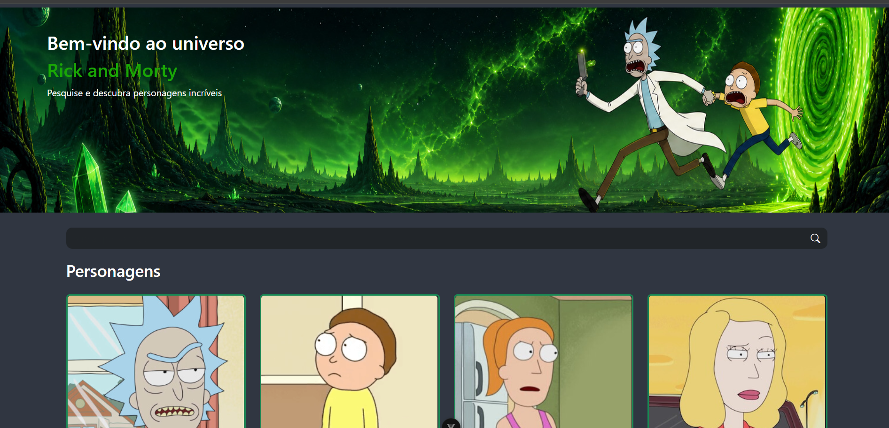
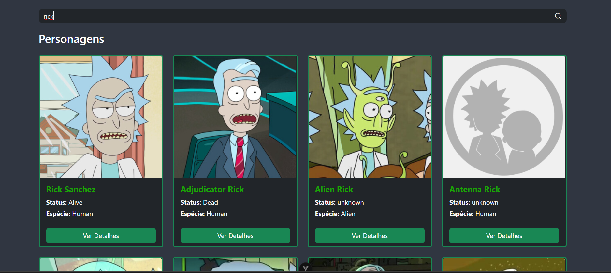
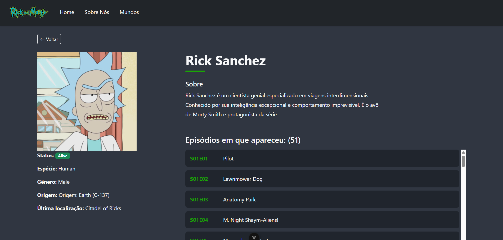
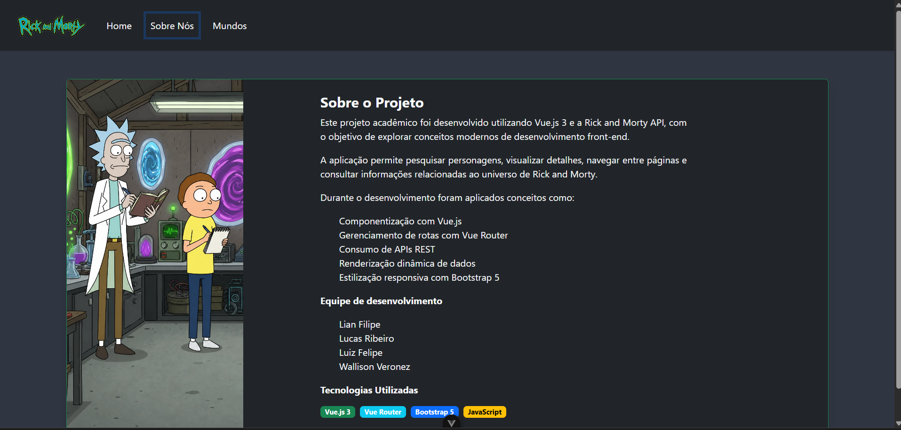

# 👾 Rick and Morty API


Aplicação web desenvolvida com Vue.js para consumo da API pública Rick and Morty, permitindo pesquisar personagens, visualizar detalhes e navegar pelas informações disponibilizadas pela API.

---

## 📖 Sobre o Projeto

O projeto foi desenvolvido durante a graduação em Análise e Desenvolvimento de Sistemas com o objetivo de praticar o desenvolvimento de aplicações utilizando Vue.js, consumo de APIs REST e componentização.

A aplicação consulta a API pública Rick and Morty para exibir informações sobre os personagens da série de forma dinâmica e responsiva.

---

## ✨ Funcionalidades

- Listagem de personagens
- Pesquisa de personagens por nome
- Visualização de detalhes dos personagens
- Navegação entre páginas utilizando Vue Router
- Consumo de API REST
- Tratamento de páginas inexistentes (404)

---

## 🛠️ Tecnologias Utilizadas

### 💻 Front-end

- Vue.js 3
- Vue Router
- JavaScript
- HTML5
- CSS3
- Bootstrap

### ⚙️ Build

- Vite

### 🌐 API

- Rick and Morty API

### 🔧 Ferramentas

- Git
- GitHub

---

## 🏗️ Arquitetura

O projeto foi organizado de forma modular utilizando a estrutura recomendada pelo Vue.js, separando componentes reutilizáveis, páginas, serviços e configuração de rotas.

- **components/** → Componentes reutilizáveis da interface.
- **views/** → Páginas da aplicação.
- **services/** → Comunicação com a API.
- **router/** → Configuração das rotas.
- **data/** → Dados utilizados pela aplicação.
- **assets/** → Imagens e arquivos estáticos.

---

## 📂 Estrutura do Projeto

```text
📦 Projeto-Rick-and-Morty
├── public
├── src
│   ├── assets
│   ├── components
│   ├── data
│   ├── router
│   ├── services
│   ├── views
│   ├── App.vue
│   └── main.js
├── index.html
├── package.json
├── vite.config.js
└── README.md
```

---

## 🚀 Como Executar

### Pré-requisitos

- Node.js
- npm

### Clone o repositório

```bash
git clone https://github.com/LFFavoretto/Projeto-Rick-and-Morty.git
```

### Entre na pasta do projeto

```bash
cd Projeto-Rick-and-Morty
```

### Instale as dependências

```bash
npm install
```

### Execute a aplicação

```bash
npm run dev
```

Após iniciar, acesse:

```
http://localhost:5173
```

---

## 📷 Demonstração

### Página Inicial

> 

---

### Pesquisa de Personagens

> 

---

### Detalhes do Personagem

> 

---

### Página Sobre

> 

---

## 👥 Equipe

Projeto desenvolvido durante a graduação em Análise e Desenvolvimento de Sistemas.

**Integrantes**

- Lian Marinheiro
- Lucas Ribeiro
- Luiz Favoretto
- Wallison Veronez

---

## 📄 Licença

Projeto desenvolvido para fins acadêmicos e de portfólio.